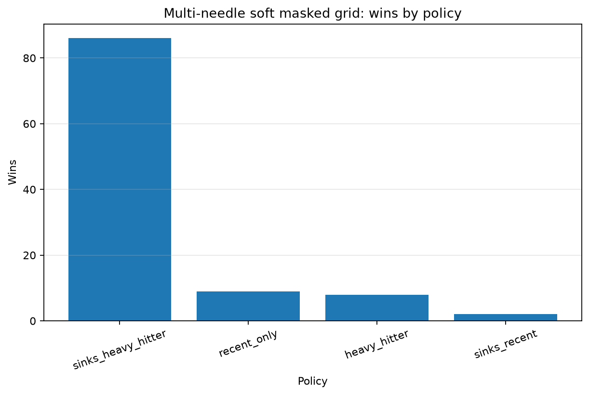
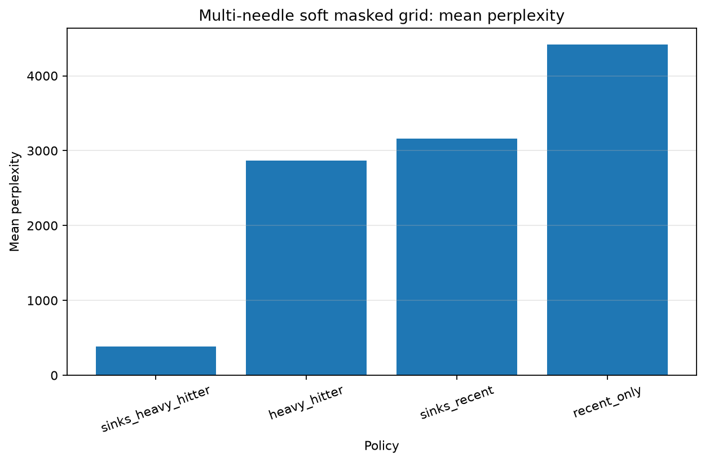
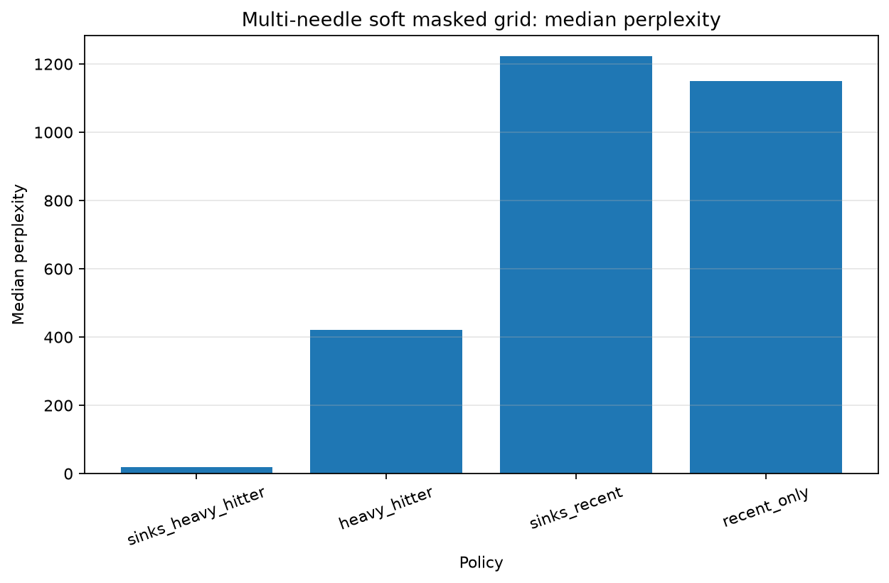
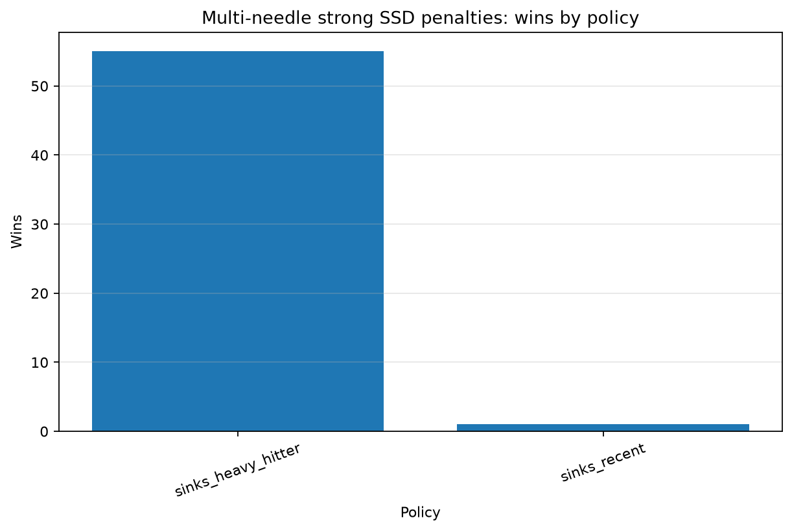
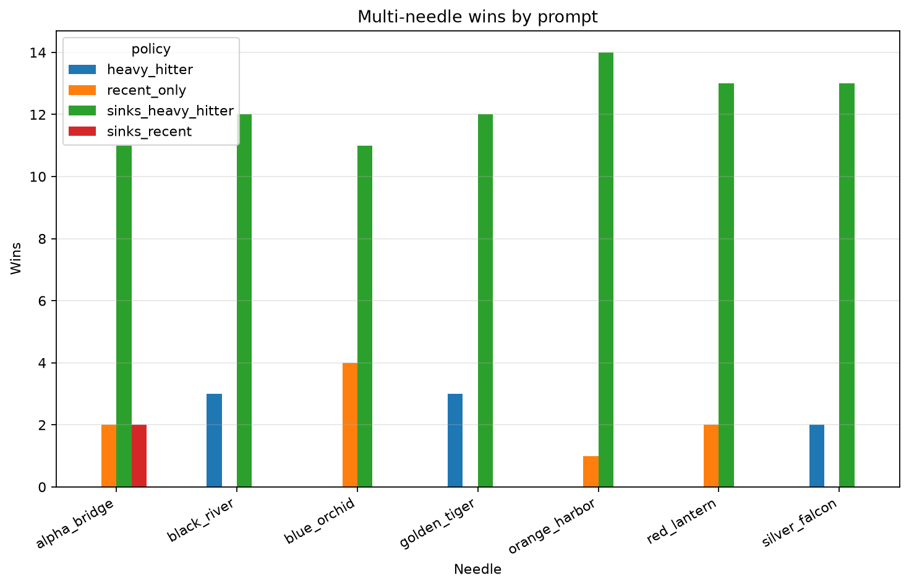

# rust-llm-pager

Rust/PyO3 prototype for experimenting with LLM KV-cache paging policies.

The project simulates tier placement for KV-cache blocks across:

- VRAM
- RAM
- SSD

It evaluates paging policies on real attention traces from a small Hugging Face model. The current benchmark does not move real KV tensors yet; it is a policy simulator used to compare placement strategies before runtime integration.

## Policies

| Policy | Description |
|---|---|
| `recent_only` | Keeps the most recent blocks hot. |
| `sinks_recent` | Keeps sink/prefix blocks plus recent blocks. |
| `heavy_hitter` | Uses attention scores to promote high-value blocks. |
| `sinks_heavy_hitter` | Keeps sink blocks, a limited recent tail, and fills the rest with high-score blocks. |

## Main result

The final benchmark uses 7 needle-in-haystack prompts, 15 memory-tier penalty settings per prompt, and teacher-forced log probability of the expected answer.

All needles are pre-filtered so the full-context model can recover the expected answer.

Setup:

- Model: `Qwen/Qwen2.5-0.5B-Instruct`
- Device used for the recorded benchmark: GTX 1050 Ti
- Valid needles: 7
- Penalty settings per needle: 15
- Total settings: 105
- VRAM budget: 256 MB
- RAM budget: 512 MB
- Evaluation: soft-masked teacher-forced logprob

| Policy | Wins | Mean PPL ↓ | Median PPL ↓ | Attention in VRAM | Swap total |
|---|---:|---:|---:|---:|---:|
| `recent_only` | 9 / 105 | ~4414.3 | ~1149.4 | ~1.4% | ~2.18 GB |
| `sinks_recent` | 2 / 105 | ~3158.5 | ~1221.9 | ~38.6% | ~2.18 GB |
| `heavy_hitter` | 8 / 105 | ~2866.9 | ~420.7 | ~54.3% | ~3.05 GB |
| `sinks_heavy_hitter` | 86 / 105 | ~384.3 | ~18.5 | ~66.0% | ~3.36 GB |

For strong SSD penalties (`SSD <= -6.0`):

| Policy | Strong-penalty wins |
|---|---:|
| `recent_only` | 0 / 56 |
| `sinks_recent` | 1 / 56 |
| `heavy_hitter` | 0 / 56 |
| `sinks_heavy_hitter` | 55 / 56 |

The hybrid `sinks_heavy_hitter` policy wins most settings overall and almost all strong-penalty settings.

## Plots











## Methodology

A needle-in-haystack prompt places an important fact near the beginning of the context and asks the model to recover it at the end.

Each candidate needle is first tested with full-context greedy generation. If the model cannot recover the expected answer with full context, the needle is excluded from the policy benchmark.

The soft-masked benchmark applies additive attention penalties by simulated memory tier:

- VRAM: `0.0`
- RAM: configurable negative penalty
- SSD: configurable stronger negative penalty

Metrics:

- `Perplexity`: lower is better.
- `Avg logprob`: higher is better.
- `Attention in VRAM`: fraction of attention mass assigned to VRAM-resident blocks.
- `Swap total`: simulated tier movement traffic.

## Run

Build the PyO3 extension:

```bash
maturin develop -m pager/Cargo.toml --release
```

Probe candidate needles:

```bash
python bench/probe_needles_hf.py
```

Run the main benchmark:

```bash
python bench/multi_needle_soft_masked_grid_hf.py
```

Summarize results:

```bash
python bench/multi_needle_soft_masked_grid_summary.py
```

Generate plots:

```bash
python bench/multi_needle_soft_masked_grid_plot.py
```

## Limitations

This project is currently a trace-driven simulator, not a production KV-cache offload backend.

Current limitations:

- It does not move real KV tensors between VRAM, RAM, and SSD.
- It does not integrate with vLLM or another inference runtime yet.
- Policy decisions are evaluated using real model attention traces, but paging itself is simulated.
- Soft masking approximates tier impact with additive attention penalties.
- Results are measured on a small model and short needle-in-haystack prompts.
- Swap traffic is simulated from tier changes and should be treated as a policy-level estimate, not hardware-measured bandwidth.

The goal of this stage is to evaluate paging policies before implementing runtime integration.
